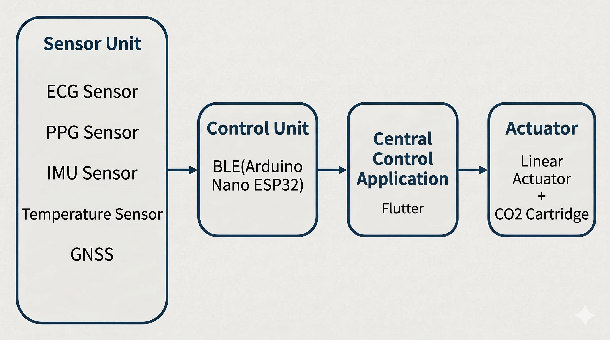
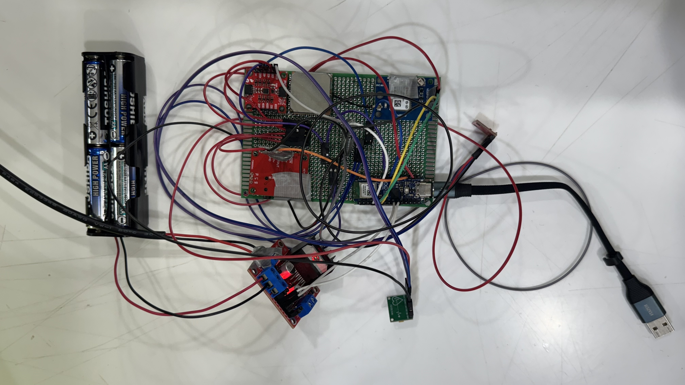
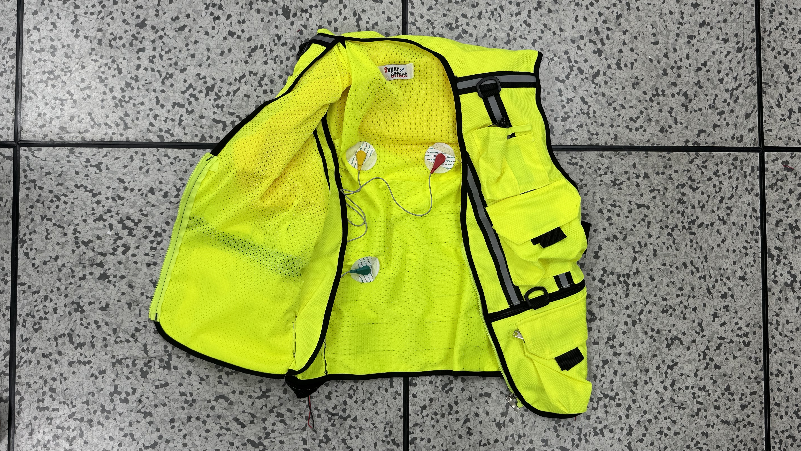
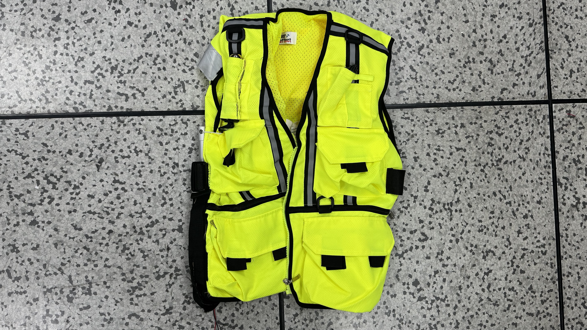

# 🦺 Sensor-based Automatic Inflatable Life Vest

<p>
  
  
  
  
</p>

<p>
  
  
  
  
</p>

<p>
  
  
  
  
</p>

This project is an **automatic inflatable smart life vest system** developed to improve the safety of divers and people engaged in water activities.
Sensors and a control unit attached to the life vest collect the user's biometric signals, body temperature, location, and movement direction. When a dangerous condition continues for a certain period, the system automatically drives the inflation module. At the same time, user status data is transmitted to a smartphone application through BLE, allowing an external supervisor to monitor the user's condition in real time.

> This root README provides an overview of the entire system.
> For detailed implementation, execution methods, and packet formats of the Arduino firmware and Flutter app, please refer to each subdirectory README.

---

## 1. Project Overview

* Won the Excellence Award at the 2025 SMU Capstone Design Competition

### Background

Conventional life vests can generally be classified into always-inflated types, manual lever-operated types, and water-contact automatic inflation types. However, these methods have several limitations in diving or underwater work environments.

* Always-inflated life vests may interfere with diving work
* Manual lever-operated life vests cannot be activated if the user is unconscious
* Water-contact automatic inflation may conflict with diving activities themselves
* Underwater accidents are difficult for others to detect immediately

To address these limitations, this project aimed to integrate **biometric signal-based risk detection**, **location and movement direction tracking**, **automatic inflation**, and **smartphone-based monitoring** into a single system.

### Goal

The goals of this system are as follows:

* Measure heart rate using ECG and PPG sensors
* Detect dangerous conditions based on a personal baseline
* Provide body temperature, GNSS location, and IMU-based direction information
* Classify user status into WARNING and ACTIVE states
* Automatically drive the inflation module when the ACTIVE state occurs
* Integrate with a smartphone app through BLE
* Display biometric signals, location, movement direction, and risk alerts in the app

---

## 2. System Architecture

The overall system consists of four main parts: the **sensor unit**, **control unit**, **inflation module**, and **smartphone application**.

<p align="center">
  <br>
  <b>Overall System Architecture</b>
</p>

The text-based data flow of the entire system is shown below.

```text
[Sensor Unit]
ECG / PPG / Temperature / IMU / GNSS
        ↓
[Control Unit]
Arduino Nano ESP32
- Sensor data acquisition
- Combined BPM calculation
- Baseline measurement
- Danger state decision
- BLE notification
        ↓
[Smartphone Application]
Flutter App
- BLE connection
- Sensor monitoring
- Graph visualization
- GPS location display
- WARNING / ACTIVE popup
        ↓
[Inflation Module]
L298N Motor Driver + Linear Actuator
- CO₂ cartridge trigger mechanism
```

---

## 3. Main Functions

### 3.1 Bio-Signal Monitoring

ECG and PPG sensors are used together to monitor the user's biometric condition.

* ECG: Measures BPM based on the electrical activity of the heart
* PPG: Measures BPM based on optical pulse changes
* Combined BPM: Integrated heart rate calculated by combining ECG and PPG values
* Temperature: Provides body temperature information to help detect hypothermia risk

Since ECG and PPG each have their own strengths and limitations, both values are used together to improve the stability of heart rate estimation.

---

### 3.2 Baseline-Based Danger Detection

Because normal heart rate ranges vary by person, the system collects the user's baseline data for a certain period after startup.

After baseline measurement, the system checks whether the current Combined BPM remains below the baseline-based threshold for a certain duration to determine a dangerous state.

| State   | Meaning                      | Action                                              |
| ------- | ---------------------------- | --------------------------------------------------- |
| NORMAL  | Normal state                 | Monitor sensor data                                 |
| WARNING | Potentially dangerous state  | Display warning status in the app                   |
| ACTIVE  | Automatic inflation required | Display app popup and activate the inflation module |

To reduce false detections caused by temporary sensor noise, the system considers not only a single measurement value, but also whether the dangerous condition continues for a certain amount of time.

---

### 3.3 Location and Direction Tracking

The GNSS module collects the user's latitude and longitude.
Since GNSS signals can become weak or unavailable in underwater environments, the system uses the last valid GNSS position as a reference location.

After GNSS signal loss, the system estimates the user's initial movement direction using IMU data and displays the result in the app as a direction string.

Example:

```text
Predicted movement direction: N
Predicted movement direction: NE
Predicted movement direction: E
```

---

### 3.4 BLE-Based Monitoring

The Arduino Nano ESP32 operates as a BLE Peripheral, while the Flutter app operates as a BLE Central.

The following information is transmitted to the app through BLE Notify:

* Location information: latitude and longitude
* Biometric information: Combined BPM, PPG BPM, and body temperature
* Baseline information: baseline Combined BPM and baseline temperature
* Movement direction: predicted angle and direction string
* Risk status: WARNING and ACTIVE

The detailed BLE packet format and parsing logic are described in the Arduino and Flutter subdirectory READMEs.

---

### 3.5 Auto-Inflation Module

When the user status is determined as ACTIVE, the control unit drives the linear actuator through the motor driver.
The linear actuator is designed to pull the CO₂ cartridge activation cord of the life vest, allowing the life vest to inflate without direct manual operation by the user.

This prototype keeps the basic operating principle of a conventional manual inflation life vest while adding electrical control.

---

## 4. Hardware Components

### 4.1 Prototype Images

The following images show the hardware configuration and the final prototype with sensors and the inflation module attached to the life vest.

<p align="center">
  <br>
  <b>Hardware Control Unit and Sensor Configuration</b>
</p>

<p align="center">
  
  <br>
  <b>Life Vest with Attached Sensors and Complete Prototype</b>
</p>

### 4.2 Component List

| Component                 | Role                                                                          |
| ------------------------- | ----------------------------------------------------------------------------- |
| Arduino Nano ESP32        | Sensor data acquisition, risk detection, BLE communication, and motor control |
| AD8232 ECG Sensor         | Heart rate measurement based on ECG signals                                   |
| MAX30102 PPG Sensor       | Heart rate measurement based on PPG signals                                   |
| TMP102 Temperature Sensor | Body temperature measurement                                                  |
| ICM-20948 IMU             | Movement and direction estimation                                             |
| GNSS Module               | Location data acquisition                                                     |
| L298N Motor Driver        | Linear actuator control                                                       |
| Linear Actuator           | Drives the CO₂ cartridge activation cord                                      |
| CO₂ Cartridge Life Vest   | Target life vest for inflation                                                |
| Flutter Smartphone App    | Real-time status monitoring                                                   |

For detailed pin configuration and sensor initialization, please refer to `arduino/README.md`.

---

## 5. Software Components

### Arduino Firmware

The Arduino firmware is responsible for sensor data acquisition, baseline calculation, danger state detection, motor control, and BLE data transmission.

For more details, refer to the following file.

```text
hw_code/README.eng.md
```

### Flutter Application

The Flutter app is responsible for BLE device scanning and connection, sensor data reception, graph visualization, user location display, and WARNING / ACTIVE popup alerts.

For more details, refer to the following file.

```text
sw_code/README.eng.md
```

---

## 6. Application Screens

The Flutter app consists of the following functional screens.

| Screen                 | Function                                                                   |
| ---------------------- | -------------------------------------------------------------------------- |
| Home                   | Displays BLE connection status, baseline results, and BLE device scan list |
| Real-Time Status       | Displays Combined BPM and body temperature graphs                          |
| User Location          | Displays GNSS location and movement direction received through BLE         |
| Real-Time Heart Rate   | Displays real-time heart rate based on PPG                                 |
| Warning / Active Popup | Displays popup alerts when a dangerous state occurs                        |

---

## 7. Operation Flow

```text
1. The user wears the smart life vest
2. Arduino Nano ESP32 and sensors are initialized
3. The Flutter app scans and connects to the BLE device
4. Baseline data is collected during the initial wearing period
5. ECG / PPG / temperature / GNSS / IMU data is collected
6. Combined BPM is calculated
7. The dangerous state is determined based on the baseline threshold
8. The system determines NORMAL / WARNING / ACTIVE status
9. Status information is transmitted to the app through BLE Notify
10. The inflation module is activated when the ACTIVE state occurs
11. The app displays location, direction, biometric signals, and risk alerts
```

---

## 8. Research Result Summary

In this project, an automatic inflatable smart life vest prototype was implemented by integrating a sensor unit, control unit, BLE communication unit, and inflation module into a conventional life vest.

The implementation results are as follows:

* Measured Combined BPM based on ECG and PPG data
* Detected dangerous conditions based on the user's baseline
* Classified user status into WARNING and ACTIVE states
* Implemented inflation operation using a linear actuator when the ACTIVE state occurs
* Integrated the system with a Flutter app through BLE
* Displayed biometric signal graphs, baseline results, user location, and movement direction in the app
* Displayed app popup alerts when a dangerous state occurs

Through this project, it was confirmed that risk detection and automatic inflation can be connected into a single system beyond simple biometric monitoring.

---

## 9. Limitations

This project is currently at the prototype stage, and the following improvements are required before applying it to real underwater work environments.

### 9.1 BLE Communication Range

BLE is a short-range communication method, so its communication distance is limited.
Especially in underwater environments, wireless signals can rapidly weaken. Therefore, in real operation, the smartphone or receiving device should be located above the water surface or close to the life vest.

For environments that require long-range rescue requests, integration with LTE, LoRa, satellite communication, or other long-range communication methods is required.

### 9.2 Underwater Location Accuracy

GNSS does not operate reliably underwater. Therefore, this system provides the last received GNSS position together with IMU-based direction estimation information.
However, IMU-based direction estimation can be affected by accumulated error, posture changes, and water currents, so a correction algorithm is required in future work.

### 9.3 Inflation Module Size and Weight

A linear actuator with sufficient force and stroke length was required to pull the CO₂ cartridge activation mechanism.
As a result, the size and weight of the inflation module may increase, so miniaturization and weight reduction are needed to improve actual wearability.

### 9.4 Waterproofing and Durability

The current prototype verifies the system structure and operation in a ground-based environment.
For real underwater application, a waterproof case capable of withstanding water pressure, waterproof connectors, insulation treatment, sensor mounting structure, and durability verification of the motor unit are required.

### 9.5 Power Stability

Sensor measurement, BLE communication, and motor driving all depend on stable power.
In particular, the motor requires a large instantaneous current, so the control unit power and motor power should be separated reliably. Battery level monitoring should also be added.

---

## 10. Future Improvements

* Apply a waterproof structure and waterproof connectors
* Reduce the size and weight of the inflation module
* Add battery level display and low-voltage warning functions
* Integrate long-range communication methods other than BLE
* Improve IMU-based movement direction estimation accuracy
* Add sensor contact failure detection
* Add a final safety confirmation or manual release mechanism before inflation
* Conduct real underwater environment testing and durability verification
